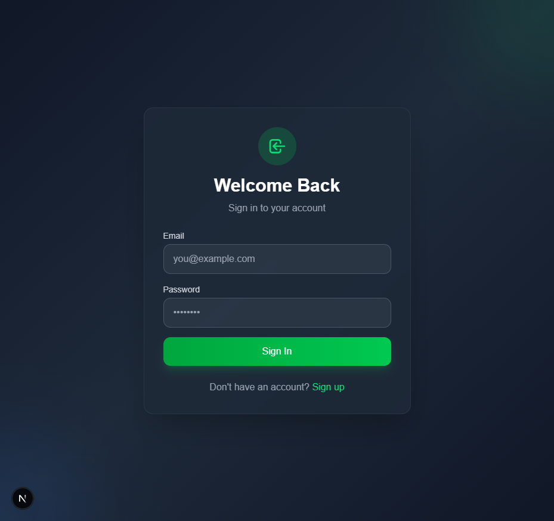
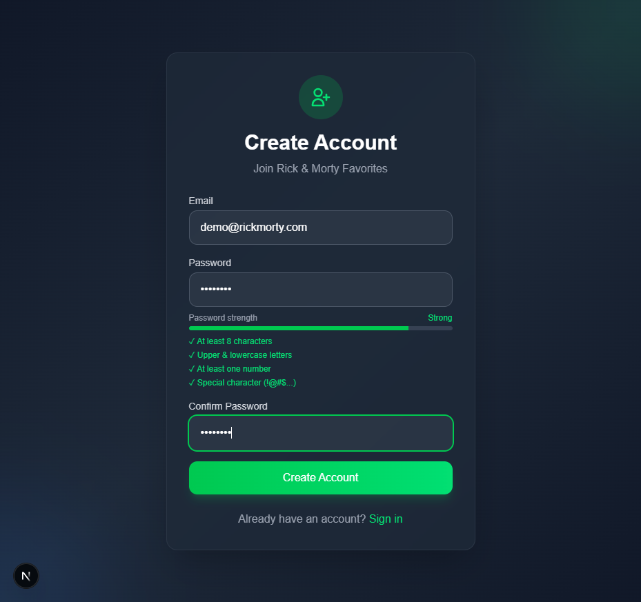
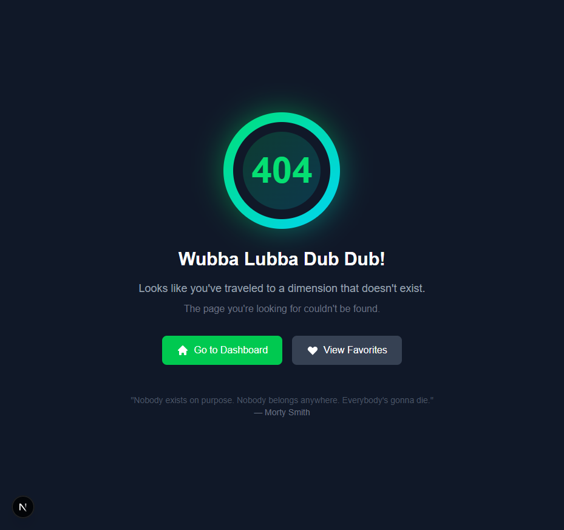
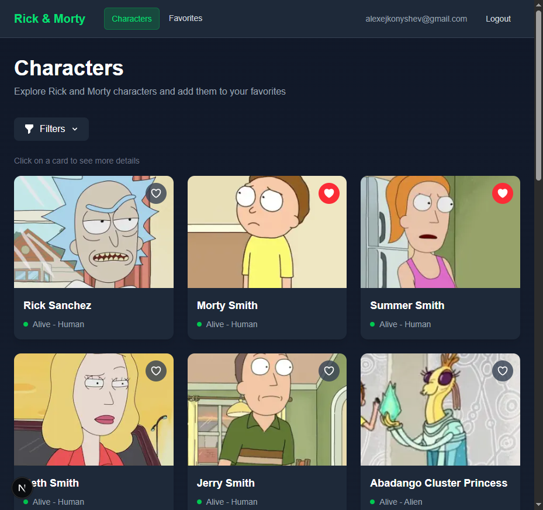
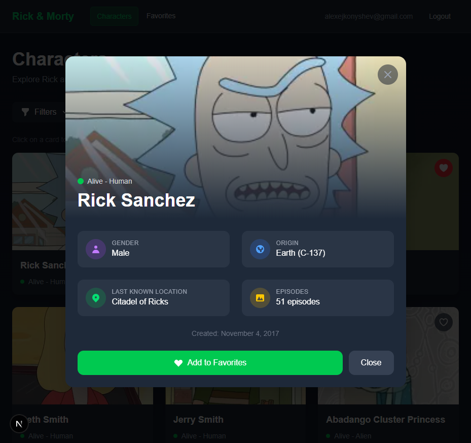

# Rick & Morty Favorites Dashboard

A Next.js application that allows users to explore Rick and Morty characters and save their favorites. Built with Supabase for authentication and database, using Edge Functions to fetch data from the Rick & Morty GraphQL API.

## 🚀 Tech Stack

- **Frontend**: Next.js 14+ (App Router), TypeScript, Tailwind CSS
- **Backend**: Supabase (PostgreSQL + Auth)
- **Edge Functions**: Deno (Supabase Edge Functions)
- **API**: Rick & Morty GraphQL API

## 📁 Project Structure

```
├── src/                          # Frontend (Next.js)
│   ├── app/                      # App Router pages
│   │   ├── dashboard/            # Characters list page
│   │   ├── favorites/            # User favorites page
│   │   ├── login/                # Login page
│   │   ├── signup/               # Sign up page
│   │   └── not-found.tsx         # Custom 404 page
│   ├── components/               # React components
│   │   ├── CharacterCard.tsx     # Character display card (clickable)
│   │   ├── CharacterModal.tsx    # Character details modal (accessible)
│   │   ├── CharacterFilters.tsx  # Search and filter controls (debounced)
│   │   ├── ErrorBoundary.tsx     # Global error boundary
│   │   ├── Loading.tsx           # Skeleton loaders
│   │   ├── Navbar.tsx            # Navigation with active links
│   │   ├── Pagination.tsx        # Page navigation
│   │   ├── PasswordStrength.tsx  # Password requirements indicator
│   │   ├── Toast.tsx             # Toast notification system
│   │   └── icons/                # Reusable SVG icon components
│   ├── lib/                      # Utilities & Supabase clients
│   │   ├── constants.ts          # Centralized constants
│   │   ├── hooks/                # Custom React hooks
│   │   │   ├── useDebounce.ts    # Debounce hook for values/callbacks
│   │   │   ├── useFavorites.ts   # Favorites management with rate limiting
│   │   │   └── useLock.ts        # Lock mechanism for async operations
│   │   └── supabase/             # Supabase clients
│   │       ├── client.ts         # Browser client
│   │       ├── server.ts         # Server client
│   │       ├── middleware.ts     # Middleware client
│   │       └── hooks.ts          # useSupabase singleton hook
│   └── types/                    # TypeScript types
│
├── supabase/                     # Backend (Supabase)
│   ├── functions/                # Edge Functions
│   │   └── get-characters/       # GraphQL proxy with validation
│   └── migrations/               # SQL migrations
```

## 🛠️ Setup Instructions

### Prerequisites

- Node.js 18+
- npm or yarn
- Supabase account
- Supabase CLI (optional, for local development)

### 1. Clone the repository

```bash
git clone <repository-url>
cd mindpal_task
```

### 2. Install dependencies

```bash
npm install
```

### 3. Set up Supabase

1. Create a new project at [supabase.com](https://supabase.com)
2. Go to Project Settings → API to get your credentials
3. Copy `.env.example` to `.env.local` and fill in the values:

```bash
cp .env.example .env.local
```

```env
NEXT_PUBLIC_SUPABASE_URL=your_supabase_url
NEXT_PUBLIC_SUPABASE_PUBLISHABLE_DEFAULT_KEY=your_supabase_publishable_default_key_here
```

### 4. Run database migrations

Navigate to your Supabase project's SQL Editor and run the migration file:

```sql
-- Copy contents from: supabase/migrations/create_favorite_characters.sql
```

This will create:
- `favorite_characters` table
- Row Level Security (RLS) policies
- Necessary indexes

### 5. Deploy Edge Function

Using Supabase CLI:

```bash
# Login to Supabase (will open browser for authentication)
npx supabase login

# Link your local project to remote Supabase project
npx supabase link --project-ref <your-project-ref>

# Deploy the Edge Function (--no-verify-jwt makes it publicly accessible)
npx supabase functions deploy get-characters --no-verify-jwt
```

> **Note**: The `--no-verify-jwt` flag is required because this function proxies a public API and doesn't need authentication. Without this flag, you'll get 401 Unauthorized errors.

You can find your `project-ref` in your Supabase Dashboard URL: `https://supabase.com/dashboard/project/<project-ref>`

Or manually via Supabase Dashboard:
1. Go to Edge Functions in your Supabase Dashboard
2. Create a new function named `get-characters`
3. Copy the code from `supabase/functions/get-characters/index.ts`
4. In function settings, disable "Verify JWT"

### 6. Configure Authentication

In your Supabase Dashboard:
1. Go to Authentication → Settings
2. Enable Email/Password sign-in
3. (Optional) Disable email confirmation for easier testing

### 7. Run the development server

```bash
npm run dev
```

Open [http://localhost:3000](http://localhost:3000) in your browser.

## 🔑 Environment Variables

| Variable | Description |
|----------|-------------|
| `NEXT_PUBLIC_SUPABASE_URL` | Your Supabase project URL |
| `NEXT_PUBLIC_SUPABASE_PUBLISHABLE_DEFAULT_KEY` | Your Supabase Publishable default key |

## 📊 Database Schema

### favorite_characters

| Column | Type | Description |
|--------|------|-------------|
| `id` | UUID | Primary key |
| `user_id` | UUID | Foreign key to auth.users |
| `character_id` | INT | Rick & Morty character ID |
| `character_name` | TEXT | Character name |
| `character_image` | TEXT | Character image URL (optional) |
| `character_status` | TEXT | Character status (Alive/Dead/unknown) |
| `character_species` | TEXT | Character species |
| `created_at` | TIMESTAMPTZ | Creation timestamp |

**Constraints:**
- Unique constraint on `(user_id, character_id)`
- RLS enabled: users can only access their own favorites

## 🔒 Row Level Security Policies

- **SELECT**: Users can only view their own favorites
- **INSERT**: Users can only insert favorites for themselves
- **DELETE**: Users can only delete their own favorites

## 🌐 Edge Function

The `get-characters` Edge Function acts as a proxy to the Rick & Morty GraphQL API:

- Fetches paginated character data
- Validates input parameters
- Handles errors gracefully
- Returns formatted JSON response

**Endpoint**: `POST /functions/v1/get-characters`

**Request body**:
```json
{
  "page": 1,
  "filter": {
    "name": "Rick",
    "status": "Alive"
  }
}
```

## 🎯 Key Technical Decisions

1. **GraphQL via Edge Function**: All Rick & Morty API requests go through Supabase Edge Functions, not directly from the frontend. This provides:
   - Better security
   - Rate limiting control
   - Server-side error handling
   - **Input validation** (filter values validated against whitelist)

2. **Supabase SSR**: Using `@supabase/ssr` for proper server-side rendering and cookie-based authentication in Next.js App Router.

3. **Row Level Security**: Database-level security ensures users can only access their own data, even if the client is compromised.

4. **Middleware Protection**: Routes `/dashboard` and `/favorites` are protected at the middleware level, redirecting unauthenticated users to login.

5. **Singleton Supabase Client**: Custom `useSupabase` hook ensures only one Supabase client instance per browser session, preventing memory leaks.

6. **Debounced Filters**: Search input uses debounce (300ms delay) to reduce API calls while typing.

7. **Operation Locking**: Favorite toggle buttons use a lock mechanism (per-character) to prevent race conditions from double-clicks.

8. **Accessibility**: Modal component includes focus trap, ARIA attributes, and keyboard navigation support.

9. **Rate Limiting**: Client-side rate limiting (1s cooldown) prevents API spam from rapid clicks.

10. **Centralized Favorites Hook**: `useFavorites` hook manages all favorites logic with proper error handling, reducing code duplication.

## 📝 Features

### Core Features
- ✅ User authentication (Sign up / Login)
- ✅ Protected routes with middleware
- ✅ Character listing with pagination
- ✅ Add/Remove favorites (one-click with lock)
- ✅ Favorites page with pagination
- ✅ Row Level Security (users own data only)
- ✅ Edge Function for GraphQL proxy with validation

### UI/UX Features
- ✅ **Character Details Modal** - Click on any card to see detailed info (gender, origin, location, episode count)
- ✅ **Toast Notifications** - Feedback on add/remove favorites
- ✅ **Active Navigation Links** - Visual indication of current page
- ✅ **Custom 404 Page** - Rick & Morty themed error page
- ✅ **Skeleton Loading** - Animated loading cards
- ✅ **Filters** - Search by name (debounced), status, species
- ✅ **Password Strength Indicator** - Visual password requirements
- ✅ **Email Confirmation Message** - After signup
- ✅ **Responsive Design** - Mobile-friendly
- ✅ **Dark Theme** - Modern dark UI with green accents

### Architecture Features
- ✅ **Error Boundary** - Global error handling with recovery UI
- ✅ **Singleton Supabase Client** - Prevents multiple client instances
- ✅ **Debounced Search** - Auto-apply filters after 300ms typing pause
- ✅ **Operation Locking** - Prevents double-click race conditions
- ✅ **Rate Limiting** - 1s cooldown between favorite operations per character
- ✅ **Centralized Favorites Hook** - `useFavorites` for DRY code
- ✅ **Accessible Modal** - Focus trap, ARIA attributes, keyboard navigation
- ✅ **Reusable Icons** - SVG icon components library
- ✅ **Centralized Constants** - No magic strings
- ✅ **Common CSS Classes** - Reusable Tailwind utilities

## 🖼️ Screenshots

### Login Page


### Signup with Password Strength


### Custom 404 Page


### Dashboard
Characters grid with filters, pagination, and clickable cards.


### Character Modal
Detailed character information including status, species, gender, origin, location, and episode count.


### Favorites
Personal collection with local search and status filter.


## 🧪 Testing

```bash
npm run build   # Check for TypeScript errors
npm run lint    # Run ESLint
```

## 🔧 Supabase CLI Commands

```bash
# Login to Supabase
npx supabase login

# Link project (run once per project)
npx supabase link --project-ref <your-project-ref>

# Deploy Edge Function
npx supabase functions deploy get-characters --no-verify-jwt

# Push database migrations
npx supabase db push

# View function logs
npx supabase functions logs get-characters
```

## 📄 License

MIT
